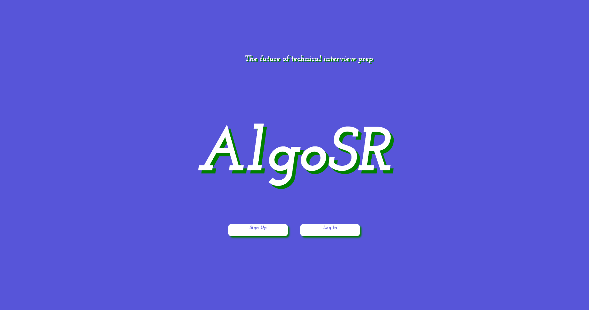

# AlgoSR

## Inspiration

Interview prep is a necessary but difficult step in the life of any software developer.

Each year, students dread the internship application season, knowing that a long, arduous journey awaits them. Month after month of practicing data structures, algorithms, and redoing Leetcode questions again and again.

We decided to create AlgoSR, a web app using spaced repetition, to make the internship preparation experience as frictionless and pleasurable as possible.

## What it does

AlgoSR uses Spaced Repetition Algorithms in order to maximize interview prep studying efficiency.

Users will add questions to AlgoSR as they complete them, and we'll set an appropriate date to remind them.

The next time a question appears, we'll ask them to gauge its difficulty, and our algorithms will adjust accordingly and remind them in the future once again.

This way, users only have to focus on a small set of tailored questions each day, without wasting time worrying about which questions to revisit and when.

## How we built it:

Front-End | Back-End
------------|-------------
HTML | Node.js
CSS | Express.js
Spectre.css | MongoDB
React.js |

## Screenshots

The landing page, with buttons for signing up and logging in.

The home page, where users can view all the questions they need to review for today.
